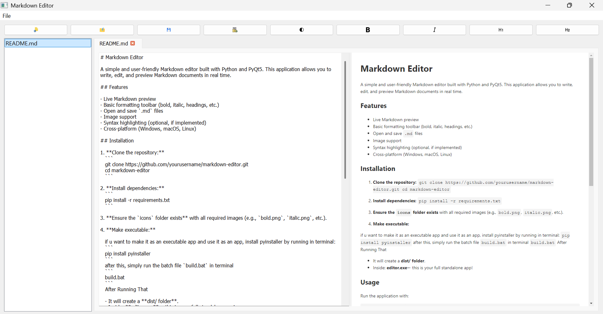

# Markdown Editor

A simple and user-friendly Markdown editor built with Python and PyQt5. This application allows you to write, edit, and preview Markdown documents in real time.

## Features

- Live Markdown preview
- Basic formatting toolbar (bold, italic, headings, etc.)
- Open and save `.md` files
- Image support
- Syntax highlighting (optional, if implemented)
- Cross-platform (Windows, macOS, Linux)

## Installation

1. **Clone the repository:**
   ```
   git clone https://github.com/yourusername/markdown-editor.git
   cd markdown-editor
   ```

2. **Install dependencies:** 
   ```
   pip install -r requirements.txt
   ```

3. **Ensure the `icons` folder exists** with all required images (e.g., `bold.png`, `italic.png`, etc.).

4. **Make executable:** 

   if u want to make it as an executable app and use it as an app, install pyinstaller by running in terminal:
   ```
   pip install pyinstaller
   ```
   after this, simply run the batch file `build.bat` in terminal
   ```
   build.bat
   ```
   After Running That

   - It will create a **dist/ folder**.
   - Inside: **editor.exe**← this is your full standalone app!

## Usage

Run the application with:
```
python editor.py
```

## Folder Structure

```
markdown-editor/
├── icons/
│   ├── bold.png
│   ├── italic.png
│   └── ... (other toolbar icons)
├── editor.py
├── requirements.txt
└── README.md
```

## Dependencies

- Python 3.7+
- pdfkit 
- pyqt5
- markdown

## Screenshots



## License

[MIT](LICENSE)

## Author

abdullah123ch


